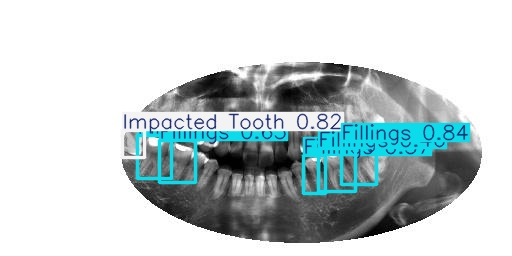
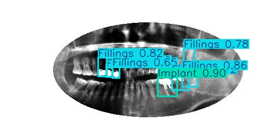

# Nazli Seyda Turkoglu

# About me

Hello! My name is Nazli, and I am a final-year Computer Science student passionate about solving real-world problems through technology. With a solid foundation in programming, software development, and problem-solving, I enjoy creating efficient, innovative, and user-friendly solutions. My academic journey has equipped me with hands-on experience in coding, algorithms, and collaborative projects, and I am eager to apply these skills in professional settings. I'm enthusiastic about learning, adapting, and growing in the ever-evolving tech industry, and I look forward to contributing to meaningful projects with a forward-thinking team.

# Education

<ul>
    <li>
        <strong>Goldsmiths University of London</strong>
        <ul>
            <li>BSc Computer Science, 2022-2025</li>
        </ul>
    </li>
    <li>
        <strong>New College</strong>
        <ul>
            <li>A Levels, 2020-2022</li>
        </ul>
    </li>
</ul>

# Skills

<ul>
    <li>Software Development</li>
    <li>Web Development</li>
    <li>Back-end</li>
    <li>Front-end</li>
    <li>Blender (3D Modeling)</li>
    <li>Language Proficiency: English, Turkish</li>
</ul>

# Languages

<ul>
    <li>JavaScript</li>
    <li>Java</li>
    <li>Python</li>
    <li>HTML</li>
    <li>CSS</li>
    <li>SQL</li>
</ul>

# Work Experience

<ul>
    <li>Internship experience: Bromcom, March 2024- August 2024</li>
</ul>

# Projects

<h1>Dental X-Ray Object Detection using YOLOv8</h1>
<ul>
    <li><strong>Overview:</strong> This project implements a deep learning-based object detection system to identify dental anomalies in panoramic X-ray images. Using the YOLOv8 model, it detects four key dental conditions: Cavities, Fillings, Impacted Teeth, and Implants.</li>
    
    <li><strong>Model:</strong> The system is powered by a fine-tuned YOLOv8n (nano) model, chosen for its balance between accuracy and real-time performance. It is trained on a custom-labeled dataset with YOLO-formatted annotations.</li>

    <li><strong>Dataset:</strong> A curated dataset of 121 annotated X-ray images was used, with over 780 labeled instances across four classes. The dataset is imbalanced, with Fillings and Implants being more frequent than Cavities and Impacted Teeth.</li>

    <li><strong>Preprocessing:</strong> The pipeline includes image normalization, data augmentation (rotation, scaling), and conversion to YOLO format with normalized bounding box coordinates.</li>

    <li><strong>Training:</strong> Model trained for 50 epochs with 640x640 image resolution and batch size of 16 using the Ultralytics YOLOv8 framework.</li>

    <li><strong>Evaluation:</strong> The model achieved high precision and recall for Fillings and Implants (e.g., Implant precision: 0.93, mAP50: 0.97). Cavity detection performance was lower due to class imbalance and object subtlety.</li>

    <li><strong>Deployment:</strong> A basic inference environment simulates how a dentist could upload an image and review model-predicted bounding boxes and anomaly types for decision support (not for clinical use).</li>

    <li><strong>Limitations:</strong> Detection of small or faint anomalies like cavities was less reliable. Improvements can be made with more balanced data, higher-resolution images, and extended training.</li>

    <li><strong>Future Work:</strong> Plans include scaling to larger datasets, experimenting with larger YOLOv8 variants, and exploring real-time integration into dental imaging tools for educational or second-opinion purposes.</li>

</ul>

<h1>Website for a bookshop</h1>
<ul>
    <li>Full-Stack Web Development: Integrating frontend templates (EJS/Pug) with backend technologies (Node.js and Express) and connecting to databases using MySQL.</li>
    <li>API Development and Integration: Designing and implementing APIs for your application and consuming data from publicly available APIs to enrich functionality.</li>
</ul>

<a href="https://www.youtube.com/watch?v=dGsDyyeznKE" target="_blank">Click here to watch on YouTube</a>

<h1>Game Project</h1>
<ul>
    <li>Understanding the basic ideas of programming, including variables and memory.</li>
    <li>Designing and implementing a small program that uses simple control structures, including loops using JavaScript within the p5.js framework.</li>
    <li>Developing a programme with several interacting classes and objects.</li>
</ul>

<a href="https://youtu.be/O34r5LWpxp4" target="_blank">Click here to watch on YouTube</a>

<h1>Hangman Game</h1>
<ul>
    <li>A simple Hangman game made using Java.</li>
    <li>Learned how to create a GUI for a more interactive experience.</li>
</ul>

<a href="https://youtu.be/n6Dd7LVeBQM" target="_blank">Click here to watch on YouTube</a>

<h1>StudyPals (Group project)</h1>

A social media app for students to connect based on their subjects and interests.
Skills developed and outcomes:

<ul>
    <li>Research the technical, social and creative context of a particular software application and apply this research to software design.</li>
    <li>Understanding methods involving users in design and demonstrating interface prototyping.</li>
    <li>Software project management and working in a team.</li>
    <li>Designing and implementing software that fits a particular user need and that demonstrates a clear aesthetic design.</li>
</ul>

<a href="https://www.youtube.com/watch?v=KJ54NI7sPEw" target="_blank">Click here to watch on YouTube</a>

<h1>Collage</h1>
<ul>
    <li>Developed proficiency in generative art techniques, image manipulation, and blending using p5.js.</li>
    <li>Explored layering, color blending, and spatial arrangements to create visually striking compositions.</li>
    <li>Applied OOP principles through reusable components like the ImageShard class.</li>
    <li>Utilized math and randomness to create dynamic visual effects like glitches and transformations.</li>
    <li>Produced an innovative digital artwork combining artistic inspiration with technical execution.</li>
</ul>

<a href="https://www.youtube.com/watch?v=JyQ6_NoLaJM" target="_blank">Click here to watch on YouTube</a>

<h1>3D Animation</h1>
<ul>
    <li>3D Graphics Programming: Learned to create and manipulate 3D objects, handle lighting, and work with camera controls in p5.js.</li>
    <li>Object-Oriented Programming (OOP): Developed and managed reusable components with encapsulated properties and methods.</li>
    <li>Physics Simulation: Applied basic physics principles, such as forces, velocity, collision detection, and response within a constrained 3D environment.</li>
    <li>Mathematical Problem-Solving: Utilized vectors for operations like direction, distance calculation, and normalizing to create realistic behaviors and effects.</li>
</ul>

<a href="https://www.youtube.com/watch?v=Id5PRPIkJAI" target="_blank">Click here to watch on YouTube</a>

<h1>Drawing App</h1>
<ul>
    <li>Implementing interactive user tools (e.g., drawing tools, sliders, color pickers) using JavaScript and libraries like p5.js.</li>
    <li>Utilizing inline JavaScript for dynamic and interactive components (e.g., event handling for save, clear, or customize features).</li>
    <li>Organizing functionality into multiple modular JavaScript files (e.g., sketch.js, toolbox.js) for better maintainability and scalability.</li>
    <li>Frontend and Multimedia Integration: Integrating multimedia assets like images, icons, and buttons into a web page for enhanced user experience.</li>
</ul>

<a href="https://www.youtube.com/watch?v=aB5QlNL5TWs" target="_blank">Click here to watch on YouTube</a>
