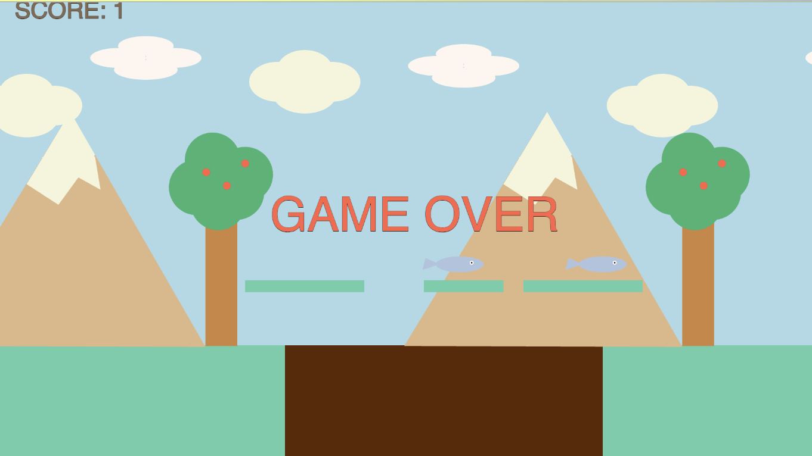

# Nazli Seyda Turkoglu

# About me

Hello! My name is Nazli, and I am a final-year Computer Science student passionate about solving real-world problems through technology. With a solid foundation in programming, software development, and problem-solving, I enjoy creating efficient, innovative, and user-friendly solutions. My academic journey has equipped me with hands-on experience in coding, algorithms, and collaborative projects, and I am eager to apply these skills in professional settings. I'm enthusiastic about learning, adapting, and growing in the ever-evolving tech industry, and I look forward to contributing to meaningful projects with a forward-thinking team.

# Education

<ul>
    <li>
        <strong>Goldsmiths University of London</strong>
        <ul>
            <li>BSc Computer Science, 2022-2025</li>
        </ul>
    </li>
    <li>
        <strong>New College</strong>
        <ul>
            <li>A Levels, 2020-2022</li>
        </ul>
    </li>
</ul>

# Skills

<ul>
    <li>Software Development</li>
    <li>Web Development</li>
    <li>Back-end</li>
    <li>Front-end</li>
    <li>Blender (3D Modeling)</li>
    <li>Language Proficiency: English, Turkish</li>
</ul>

# Languages

<ul>
    <li>JavaScript</li>
    <li>Java</li>
    <li>Python</li>
    <li>HTML/li>
    <li>CSS</li>
    <li>SQL</li>
</ul>

# Work Experience

<ul>
    <li>Internship experience: Bromcom, March 2024- August 2024</li>
</ul>

# Projects

<h1>Game Project</h1>
<ul>
    <li>Understanding the basic ideas of programming, including variables and memory.</li>
    <li>Designing and implementing a small program that uses simple control structures, including loops using JavaScript within the p5.js framework.</li>
    <li>Developing a programme with several interacting classes and objects.
</li>
</ul>
    
<a href="https://youtu.be/O34r5LWpxp4" target="_blank">Click here to watch on YouTube</a>

<h1>Hangman Game</h1>
<ul>
    <li>A simple Hangman game made using Java.</li>
    <li>Learned how to create a GUI for a more interactive experience.</li>
</ul>

